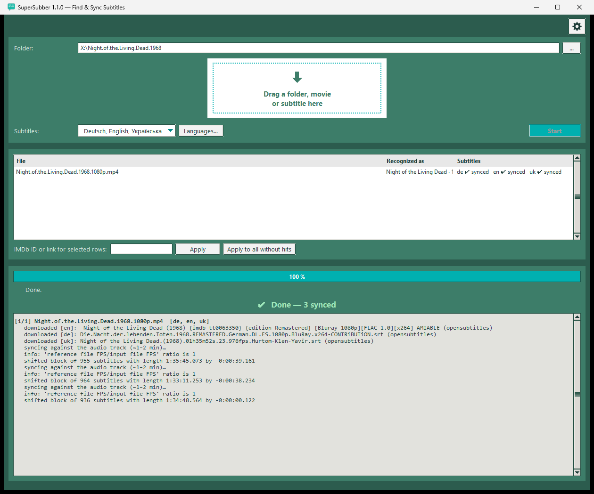
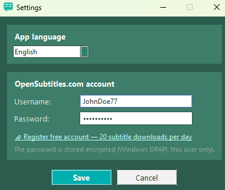

# supersubber — Find & Sync Subtitles

Portable Windows tool: downloads missing subtitles for every video in a folder (recursively) and synchronizes them against the audio track — fixing framerate drift (23.976 ↔ 25 fps), constant offsets and ad-break jumps. The result is saved as `<video>.<lang>.srt` next to the video, where Kodi, VLC and friends pick it up automatically.

Under the hood: [subliminal](https://github.com/Diaoul/subliminal) (search & download from multiple providers) + [alass](https://github.com/kaegi/alass) (sync via voice-activity analysis). See `THIRD-PARTY.md`.

*Deutsche Anleitung: [README.de.md](README.de.md)*

<p align="center"></p>

## Usage

1. Download the latest release zip, unpack it anywhere, run `supersubber.exe` — portable, no installation.
2. Drag a folder into the window (or pick one), tick the subtitle languages you want, hit **Start**.
3. Watch the per-episode progress; a summary appears at the end. Videos that already have subtitles in a language are skipped, so re-running is always safe.
4. `supersubber.exe <folder> [--lang ru,de]` starts processing that folder right away.

The UI speaks English, German and Russian (⚙ → app language; the Windows display language is picked on first start). The subtitle-language dropdown starts with the ten most common languages — the **Languages…** button opens a searchable list of ~40 more, shown in their native names.

**Sync your own subtitle file:** drag a `.srt`/`.ass` into the drop zone (alone, or together with the video). If exactly one video sits in the same folder it is picked automatically, otherwise a file dialog asks. The displaced file is kept once as `*.orig` (an extension media players ignore).

**NFO files:** if a `.nfo` next to the video contains an IMDb link (release NFOs almost always do, Kodi/Jellyfin `movie.nfo`/`tvshow.nfo` too), supersubber searches by that ID right away — original title, year or wording in the filename no longer matter.

**IMDb lookup:** if a video isn't recognized, a "Specify IMDb ID…" button appears after the run — paste the IMDb ID or link (for series: the ID of the show) and search again.

**"No subtitles found":** detection uses the full path (guessit) plus the OpenSubtitles file hash. Series need the original show title somewhere in the path (the folder name is enough, e.g. `The.Expanse\S02\S02E05.Home.mp4`) and `SxxExx` in the filename — the episode title's language doesn't matter. Movies need original title + year in the filename. supersubber never guesses.

## Settings

Optional OpenSubtitles.com login (a free account adds 20 downloads/day on top of the free providers; the password is stored encrypted with Windows DPAPI in `%APPDATA%\supersubber\config.json`).

<p align="center"></p>

## Notes

- **Windows only.** Uses DPAPI and ships Windows binaries; there are no plans for other platforms right now.
- **SmartScreen warning:** the executable is not code-signed (this is a free hobby tool). Windows may warn on first start — "More info" → "Run anyway", or build from source below.
- **Provided as-is.** No support promises; issues and PRs are welcome but may take a while.

## Building from source

```powershell
python -m venv .venv; .\.venv\Scripts\pip install -r requirements.txt
.\fetch-bins.ps1          # downloads alass + ffmpeg into bin\
.\.venv\Scripts\python -m supersubber [folder]
.\build.ps1               # dist\supersubber\ + dist\supersubber-<version>-win64.zip
```

Project layout: `supersubber/core.py` (pipeline), `supersubber/app.py` (Tkinter GUI), `supersubber/config.py`, `supersubber/i18n.py`.

Note: `subliminal` is pinned to an exact version because supersubber patches the OpenSubtitles.com provider to pass the series IMDb ID for episode searches (an upstream TODO). Bump the pin only after checking that patch in `core.py`.

## License

MIT — see [LICENSE](LICENSE). Bundled third-party binaries keep their own licenses, see [THIRD-PARTY.md](THIRD-PARTY.md).
